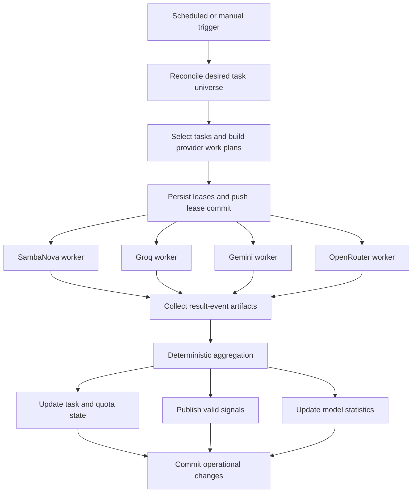
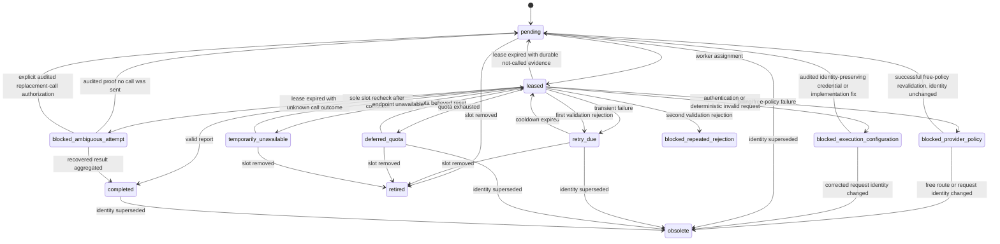

# RFC and Implementation Plan: Phase 2 Quota-Aware Multi-Provider Recalibration

## Document metadata

| Field | Value |
|---|---|
| Status | **Accepted** |
| Repository | `pedropaulofb/ontouml-according-to-the-machines` |
| Target phase | Phase 2 |
| Proposed branch | `feat/phase-2-recalibration` |
| Delivery model | One feature branch, one draft pull request, staged commits |
| Prepared | 2026-08-05 |
| Intended repository path | `docs/methodology/phases/phase-2/recalibration-rfc.md` |
| Implementation status | Stages 1–8 implemented on `feat/phase-2-recalibration`; Stage 9 validation and cutover preparation remain |
| Supersedes | The current time-based seven-slot Phase 2 signal-generation rotation |
| Does not supersede | Existing Phase 2 agent scopes, signal semantics, deterministic validation, issue semantics, exact-replacement safety, or resolver edit-validation rules |

> This accepted RFC was validated against the repository before implementation. Repository-grounded adaptations are documented by the staged commits; its normative requirements are otherwise unchanged.

---

## 1. Purpose

This RFC specifies a recalibration of the existing Phase 2 LLM execution infrastructure.

The recalibration replaces repeated time-based sampling with content-addressed, quota-aware execution across multiple free provider–model combinations. It is intended to:

- use as much approved free LLM capacity as is safely available;
- avoid repeating completed reviews of unchanged inputs;
- reduce tokens consumed by each necessary call;
- keep provider failures and exhausted quotas isolated;
- preserve all existing Phase 2 review capabilities and output contracts;
- make later quota allocation between Phase 2 and Phase 3 configurable;
- retain the existing freedom to run GitHub Actions and create operational commits frequently.

The recalibration changes **how Phase 2 executes**, not **what Phase 2 does**. It therefore remains part of Phase 2. The future direct-quotation work remains Phase 3.

---

## 2. Normative language

The terms **MUST**, **MUST NOT**, **SHOULD**, **SHOULD NOT**, and **MAY** are normative.

- **MUST / MUST NOT** indicate binding requirements.
- **SHOULD / SHOULD NOT** indicate expected implementation choices that may be changed only for a documented technical reason.
- **MAY** indicates implementation discretion.
- A deviation from a MUST-level requirement requires an amendment to this RFC before merge.

---

## 3. Current Phase 2 baseline

Phase 2 currently provides:

1. a deterministic page-structure checker;
2. an LLM-based page-hygiene checker;
3. an LLM-based language/style checker;
4. deterministic validation and normalization of LLM signal reports;
5. issue creation and update logic;
6. exact-replacement safety checks;
7. an automated resolver that obtains a strict edit plan, validates it, applies accepted edits, updates the review log, opens or updates a pull request, and closes the source issue when resolution succeeds;
8. cumulative model-run statistics.

The two LLM signal agents are:

```text
page-hygiene-checker
language-style-checker
```

The canonical corpus contains:

```text
21 class-stereotype pages
18 relation-stereotype pages
39 total pages
```

The current scheduled collector uses a time-based provider/model rotation and selects at most one logical task in each scheduled run. Aggregate model statistics are persisted, but exact completion state for every page–agent–provider–model combination is not.

The current system can therefore repeat logically equivalent work after unrelated commits or over time, even when the relevant page input and configuration have not changed.

---

## 4. Problem statement

The principal constrained resource is LLM quota, especially free request and token capacity.

GitHub Actions usage, workflow frequency, and commit volume are **not** optimization targets for this recalibration.

The current execution model has five material problems:

1. **No exact completion memory**

   It does not reliably know that a specific provider–model slot has already reviewed a specific agent-scoped page input under a specific prompt and request configuration.

2. **Global commit identity causes unnecessary review churn**

   The global repository SHA is used in review metadata and identity-related behavior, even when only statistics or unrelated files changed.

3. **Provider capacity is heterogeneous**

   Some limits are provider-wide, some are model-specific, some are project- or organization-wide, and some are only discoverable after a request fails.

4. **Provider/model availability changes**

   Free endpoints may be added, retired, temporarily unavailable, moved behind billing, or exposed with different request controls.

5. **Prompt and reasoning overhead consume avoidable tokens**

   Repeated instructions, unnecessary reasoning, and oversized resolver context reduce the useful work obtainable from free quotas.

---

## 5. Goals

The implementation MUST:

1. treat every configured `provider + model` combination as an independent review slot;
2. generate and track every applicable page–agent task for every configured, non-retired slot;
3. use the maximum safely available free capacity;
4. impose no fixed global daily-call limit;
5. avoid repeating completed unchanged tasks;
6. count valid zero-signal outputs as completed reviews;
7. preserve current Phase 2 signal Markdown, validation, issue, and resolver semantics;
8. prohibit automatic paid usage;
9. isolate exhausted or failing quota groups so other providers and models continue;
10. persist enough state to resume after interruptions;
11. preserve historical model statistics when models are removed;
12. make provider/model status and quota observations visible;
13. support one-branch/one-PR implementation and branch-level testing;
14. keep future per-phase quota allocation configurable;
15. reduce repeated prompt and reasoning tokens without reducing the defined review scope;
16. coordinate shared quota use across signal generation and the automated resolver so signal collection does not unnecessarily starve actionable resolver work.

---

## 6. Non-goals

The initial implementation MUST NOT:

1. implement Phase 3;
2. rename Phase 3 to Phase 4;
3. change the substantive responsibilities of the Phase 2 agents;
4. add source-faithfulness, paper validation, ontology semantics, conceptual adequacy, or cross-page semantic review to Phase 2;
5. alter the human-facing Phase 2 signal format unless separately approved;
6. alter exact-replacement safety rules;
7. alter the resolver’s deterministic edit acceptance rules;
8. introduce paid provider fallback;
9. optimize GitHub Actions minutes, workflow count, or commit count;
10. delete historical issues, comments, statistics, or run records;
11. implement semantic section-level segmentation in the first recalibration release;
12. permanently remove a model only because one or more outputs are poor;
13. make the random `openrouter/free` router a configured review slot;
14. assume that unused daily free quota can be banked for later phases.

---

## 7. Accepted decisions

| Topic | Accepted decision |
|---|---|
| Independent execution unit | A provider–model slot |
| Same underlying model from two providers | Two independent slots and two independent tasks |
| Initial Phase 2 allocation | 100% of approved free capacity |
| Fixed global call ceiling | None |
| Execution rate | Maximum safely usable free capacity |
| GitHub Actions usage | Not a concern |
| Operational commits | May continue after every scheduler run |
| Completion identity | Agent-scoped content and configuration identity |
| Global repository SHA | Traceability metadata only; never completion identity |
| Valid result with zero signals | Completed |
| Valid result with signals | Completed, independently of later publication retries |
| Validator rejection | Two attempts for the unchanged task identity; then block |
| Immediate retry after quota failure | Prohibited |
| Paid fallback | Prohibited |
| SambaNova | Retained as an active free provider, based on the user’s account confirmation |
| Cerebras | Removed from active signal generation and resolver fallback |
| Old Laguna M.1 | Removed without replacement obligation |
| Laguna S 2.1 and XS 2.1 | Included as distinct OpenRouter free slots |
| New free models | Included directly in the permanent full queue; no pre-admission canary |
| Preview models | Included until unavailable or explicitly removed |
| Resolver primary | Gemini `gemini-3.5-flash` |
| Resolver fallback | Groq `openai/gpt-oss-120b` |
| Resolver priority on shared slots | Eligible resolver work has priority over signal-generation tasks for `gemini:gemini-3.5-flash` and `groq:openai/gpt-oss-120b`; when no eligible resolver work exists, their remaining free capacity is available to signal generation |
| Semantic segmentation | Deferred |
| Branching | One feature branch and one draft PR |
| Phase naming | Recalibration remains within Phase 2 |
| Phase 3 integration | Later quota reallocation through configuration, not current Phase 3 design |

---

## 8. Verified provider-portfolio total

The user-supplied Gemini model catalogue includes:

```text
gemini:gemini-3-flash-preview
```

Google’s current Gemini Developer API pricing page lists free-tier input and output for this model. It is therefore part of the free-only registry.

Consequences:

```text
SambaNova slots: 6
Groq slots:      3
Gemini slots:    8
OpenRouter slots:9
Total slots:     26
```

The initial task universe is:

```text
39 pages × 2 LLM agents × 26 provider–model slots = 2,028 tasks
```

This preserves the accepted rule that eligible free models are included directly.

---

# Part I — Normative technical specification

## 9. Provider–model registry

### 9.1 Registry requirements

The provider–model registry MUST be represented in one machine-readable, version-controlled configuration.

Recommended path:

```text
config/phase-2/provider-models.json
```

Each entry MUST define at least:

```json
{
  "provider": "groq",
  "model": "openai/gpt-oss-120b",
  "configuration_status": "configured",
  "execution_status": "eligible",
  "lifecycle": "production",
  "agents": [
    "page-hygiene-checker",
    "language-style-checker"
  ],
  "quota_groups": [
    "groq-organization",
    "groq:openai/gpt-oss-120b"
  ],
  "free_policy": "confirmed-free-account",
  "reasoning_policy": "low",
  "output_policy": "final-only",
  "max_completion_tokens": 3000,
  "request_config_version": "1"
}
```

The registry MUST:

- be the only authoritative configured-slot list;
- reject duplicate `provider + model` combinations;
- be deterministically ordered;
- include an explicit configuration version;
- include lifecycle status;
- include free-policy status;
- include provider/model quota-group membership;
- include request configuration that affects output or tokens;
- be validated before any provider call;
- separate permanent configuration from runtime execution availability;
- support `configured` and `retired` configuration statuses;
- support `eligible`, `temporarily_unavailable`, `blocked_provider_policy`, and `blocked_execution_configuration` execution statuses.

A temporarily unavailable, policy-blocked, or execution-configuration-blocked model MUST remain `configured` and retain its desired tasks. The registry’s `execution_status` is the initial/default value; mutable runtime execution status, cooldown, and `retry_not_before` MUST be persisted in `quota-state.json` and override that default. A model that the user explicitly removes MUST become `retired` while historical statistics remain intact.

### 9.2 Configured SambaNova slots

| # | Provider | Exact model ID | Lifecycle | Initial reasoning policy |
|---:|---|---|---|---|
| 1 | `sambanova` | `MiniMax-M2.7` | Production | Lowest supported; final output only |
| 2 | `sambanova` | `DeepSeek-V3.1` | Production | Lowest supported; final output only |
| 3 | `sambanova` | `Meta-Llama-3.3-70B-Instruct` | Production | No additional reasoning request |
| 4 | `sambanova` | `gpt-oss-120b` | Production | `low` where supported |
| 5 | `sambanova` | `DeepSeek-V3.2` | Preview | Thinking disabled |
| 6 | `sambanova` | `gemma-4-31B-it` | Preview | Lowest supported; final output only |

SambaNova is considered free for the current project based on explicit user confirmation. If a SambaNova response indicates that billing, credits, or payment activation is required, the affected slot or provider MUST be moved to `blocked_provider_policy` and MUST NOT be retried automatically.

### 9.3 Configured Groq slots

| # | Provider | Exact model ID | Lifecycle | Initial reasoning policy |
|---:|---|---|---|---|
| 7 | `groq` | `openai/gpt-oss-120b` | Production | `low` |
| 8 | `groq` | `openai/gpt-oss-20b` | Production | `low` |
| 9 | `groq` | `qwen/qwen3.6-27b` | Preview | `none` |

The Groq free-plan account MUST be used. The implementation MUST NOT select a paid service tier, on-demand burst mechanism, or billing fallback.

### 9.4 Configured Gemini slots

| # | Provider | Exact model ID | Lifecycle | Initial reasoning policy |
|---:|---|---|---|---|
| 10 | `gemini` | `gemini-3.6-flash` | Stable | `low` |
| 11 | `gemini` | `gemini-3.5-flash` | Stable | `low` |
| 12 | `gemini` | `gemini-3.5-flash-lite` | Stable | `minimal` |
| 13 | `gemini` | `gemini-3.1-flash-lite` | Stable | Lowest supported |
| 14 | `gemini` | `gemini-3-flash-preview` | Preview | `low` |
| 15 | `gemini` | `gemini-2.5-pro` | Stable | Lowest supported bounded thinking |
| 16 | `gemini` | `gemini-2.5-flash` | Stable | Thinking budget `0` |
| 17 | `gemini` | `gemini-2.5-flash-lite` | Stable | Thinking budget `0` |

Every Gemini project used for Phase 2 calls MUST remain on a no-charge API tier. Grounding, paid tools, and paid-only request modes MUST NOT be enabled.

### 9.5 Configured OpenRouter slots

| # | Provider | Exact model ID | Lifecycle | Initial reasoning policy |
|---:|---|---|---|---|
| 18 | `openrouter` | `nvidia/nemotron-3-ultra-550b-a55b:free` | Free variant | Lowest supported; exclude reasoning from final output |
| 19 | `openrouter` | `nvidia/nemotron-3-super-120b-a12b:free` | Free variant | Lowest supported; exclude reasoning from final output |
| 20 | `openrouter` | `google/gemma-4-26b-a4b-it:free` | Free variant | No thinking unless required |
| 21 | `openrouter` | `google/gemma-4-31b-it:free` | Free variant | No thinking unless required |
| 22 | `openrouter` | `poolside/laguna-s-2.1:free` | Free variant | Lowest supported; final output only |
| 23 | `openrouter` | `poolside/laguna-xs-2.1:free` | Free variant | Lowest supported; final output only |
| 24 | `openrouter` | `inclusionai/ling-3.0-flash:free` | Free variant | Lowest supported; exclude reasoning from final output |
| 25 | `openrouter` | `openai/gpt-oss-20b:free` | Free variant | `low`; exclude reasoning from final output |
| 26 | `openrouter` | `nvidia/nemotron-nano-9b-v2:free` | Free variant | Nonreasoning/final-only mode |

The exact `:free` model ID MUST be sent. The generic `openrouter/free` router MUST NOT be used because it does not preserve stable model identity.

### 9.6 Removed slots

The following MUST NOT be configured or supported for current Phase 2 execution:

```text
cerebras:gpt-oss-120b
cerebras:zai-glm-4.7
openrouter:poolside/laguna-m.1:free
groq:llama-3.3-70b-versatile
```

Historical statistics for these slots MUST remain visible as inactive or retired.

The Cerebras provider adapter MAY remain temporarily as unregistered archival code if immediate deletion creates avoidable risk, but:

- it MUST NOT be registered as a supported provider in `run_check_agent.py`, `run_check_batch.py`, `resolve_signal_issue.py`, workflow dispatch inputs, or any other standard Phase 2 execution entry point;
- direct and manual Phase 2 commands MUST reject `cerebras` as an unsupported provider;
- it MUST NOT be selectable by the production collector;
- it MUST NOT be a resolver fallback;
- its secret MUST NOT be required by the production workflows;
- documentation MUST not describe it as active free capacity.

---

## 10. Free-only enforcement

### 10.1 Invariant

> No Phase 2 execution path may cause a paid LLM request.

This invariant applies to production, manual, local, branch, shadow, generate, dry-run, signal-generation, retry, fallback, resolver, model-routing, and tool-use paths. Testing does not relax the free-only requirement.

### 10.2 Provider rules

#### OpenRouter

Before any Phase 2 OpenRouter request—including production, manual, local, branch, shadow, `generate`, and `dry-run` requests—the implementation MUST verify through the current model metadata endpoint that:

- the exact model exists;
- the exact identifier ends in `:free`;
- prompt pricing is zero;
- completion pricing is zero;
- request pricing is zero;
- internal reasoning pricing is zero or absent for the selected free route;
- no paid fallback route is enabled.

The verification MAY be cached for the duration of one workflow run or one manual/local command invocation.

A model-price change MUST result in `blocked_provider_policy`; it MUST NOT result in use of the paid variant.

#### Gemini

The implementation MUST use the configured no-charge Gemini API project. It MUST NOT enable:

- paid-only models;
- paid grounding;
- Google Search grounding;
- Google Maps grounding;
- paid tools;
- a billing-backed fallback.

#### Groq

The implementation MUST use the current free-plan limits and MUST NOT send a service-tier setting that may burst into a paid tier.

#### SambaNova

The implementation MUST use the user-confirmed free account. Billing-, credit-, or payment-required diagnostics MUST block the affected capacity rather than trigger payment or alternative paid access.

### 10.3 Error classification

Errors containing billing, payment, insufficient credits, purchase, PayGo, or equivalent diagnostics MUST be classified as `provider_policy_block`, not as an ordinary transient provider error.

Authentication or authorization failures and deterministic invalid-request failures MUST be classified separately as `execution_configuration_block`; they MUST NOT be treated as transient failures or free-policy failures.

---

## 11. Canonical task universe

### 11.1 Task dimensions

Every configured, non-retired slot MUST have every applicable combination of:

```text
canonical page × LLM check agent
```

The initial expected universe is:

```text
39 pages
× 2 agents
× 26 provider–model slots
= 2,028 tasks
```

### 11.2 Independent slots

Completion of:

```text
sambanova:gpt-oss-120b
```

MUST NOT complete:

```text
groq:openai/gpt-oss-120b
```

even though both expose the same underlying model family.

Provider and model are both mandatory task-identity fields.

### 11.3 Permanent queue meaning

“Permanent full queue” means:

- every configured, non-retired slot retains its full page-agent workload;
- slots are retained until explicitly removed or retired;
- poor statistics do not automatically remove a slot;
- temporary provider failures do not remove a slot;
- unavailable preview endpoints may be paused;
- historical task and statistic records are retained.

It does not mean retrying a confirmed retired or paid-only endpoint forever.

---

## 12. Agent-scoped input identity

### 12.1 Relevant content

The task content hash MUST be calculated from the exact agent-scoped input that will be sent to the provider.

For `page-hygiene-checker`, this is initially:

```text
the full canonical page
```

For `language-style-checker`, this is initially:

```text
the reader-facing content after the currently defined excluded sections are removed
```

Therefore, a change only inside a section excluded from the language/style input MUST NOT create a new language/style task.

### 12.2 Normalization

The content hash MUST use deterministic UTF-8 input after only nonsemantic normalization required for stable byte representation, such as:

- line endings normalized to `\n`;
- no filesystem path;
- no current date;
- no global commit SHA;
- no mutable execution timestamp.

The implementation MUST NOT normalize actual Markdown wording, spacing, punctuation, or structure in a way that could hide a review-relevant change.

### 12.3 Hash algorithm

Use:

```text
SHA-256
```

The hash MUST be stored in full in machine state. A shortened prefix MAY be displayed to humans.

---

## 13. Task identity

### 13.1 Identity fields

A task identity MUST include:

```text
phase
page path
agent
provider
model
agent-scoped content hash
prompt content hash
prompt ID
validator/schema version
request configuration hash
segmentation profile version
```

For the initial full-page implementation:

```text
segmentation profile version = full-page-v1
```

### 13.2 Canonical task identifier

The implementation SHOULD build a canonical JSON object with sorted keys and compact separators, then calculate:

```text
task_id = sha256(canonical_json)
```

Illustrative identity object:

```json
{
  "phase": "phase-2",
  "page": "docs/stereotypes/classes/kind.md",
  "agent": "language-style-checker",
  "provider": "sambanova",
  "model": "DeepSeek-V3.1",
  "content_sha256": "...",
  "prompt_id": "language-style-checker-v1.0.3",
  "prompt_sha256": "...",
  "validator_version": "check-signal-schema-v1",
  "request_config_sha256": "...",
  "segmentation_profile": "full-page-v1"
}
```

### 13.3 Nonidentity metadata

The following MAY be recorded for traceability but MUST NOT determine task identity:

- repository commit SHA;
- workflow run ID;
- review date;
- execution timestamp;
- statistics-only commits;
- unrelated file changes;
- issue number;
- pull-request number.

### 13.4 Identity-changing events

A new task MUST be created when any identity field changes, including:

- relevant page content;
- prompt content;
- prompt ID;
- deterministic validation contract;
- provider/model request configuration;
- provider;
- model;
- future segmentation profile.

The superseded task MUST become `obsolete`; it MUST NOT be deleted.

---

## 14. Persistent state

### 14.1 Storage

The initial implementation SHOULD use machine-managed JSON files committed to the repository’s default branch.

Recommended paths:

```text
config/phase-2/provider-models.json
data/phase-2/task-state.json
data/phase-2/quota-state.json
data/phase-2/result-events/
data/phase-2/pending-publication/
```

Validated result events and any payload needed for an LLM-free publication retry MUST be made durable. GitHub Actions artifacts MAY transport worker results to the aggregator, but an artifact path alone MUST NOT be the only persistent reference after aggregation.

Reasons:

- frequent commits are acceptable;
- the state is auditable;
- no external database is required;
- task identity is independent of the resulting state commits;
- existing automation already commits model statistics.

A dedicated state branch is not required by this RFC.

### 14.2 State schema

`task-state.json` MUST contain:

```json
{
  "schema_version": 1,
  "queue_generation": "phase-2-recalibration-v1",
  "registry_sha256": "...",
  "last_reconciled_at": "...",
  "tasks": {}
}
```

Every task record MUST contain at least:

```json
{
  "task_id": "...",
  "identity": {},
  "status": "pending",
  "created_at": "...",
  "updated_at": "...",
  "attempt_count": 0,
  "validation_rejection_count": 0,
  "last_attempt_at": null,
  "retry_not_before": null,
  "lease": null,
  "last_outcome": null,
  "result_record": {
    "event_path": null,
    "output_sha256": null,
    "validated_output_path": null
  },
  "publication": {
    "status": "not_started",
    "payload_path": null,
    "last_attempt_at": null,
    "last_error": null
  }
}
```

A task MUST NOT rely on an expiring workflow artifact as the sole copy of a validated output needed for publication or recovery.

### 14.3 Initial generation

Existing aggregate model statistics MUST NOT be interpreted as proof that any exact task is complete.

The recalibration MUST start a new queue generation in which all 2,028 current tasks are initially pending.

Historical issues, comments, and statistics remain historical evidence but do not seed completion.

---

## 15. Task states

### 15.1 Execution states

| State | Meaning | Schedulable? |
|---|---|---:|
| `pending` | Never attempted or returned for normal scheduling | Yes |
| `leased` | Assigned to a current workflow worker | No |
| `completed` | A valid signal report, including zero signals, was produced | No |
| `retry_due` | A retryable failure occurred and cooldown is active or expired | After `retry_not_before` |
| `deferred_quota` | Relevant quota is believed exhausted | After reset/cooldown |
| `temporarily_unavailable` | Endpoint or provider is currently unavailable | After recheck time |
| `blocked_provider_policy` | Free-only policy prevents execution | No |
| `blocked_execution_configuration` | Authentication, authorization, or deterministic request configuration prevents execution | No |
| `blocked_repeated_rejection` | Two validator-rejected attempts occurred | No |
| `blocked_ambiguous_attempt` | A lease expired without a replayable result or durable proof that no provider request was sent | No |
| `retired` | Slot was explicitly removed | No |
| `obsolete` | A newer identity superseded the task | No |

### 15.2 Publication state

Publication MUST be tracked separately from LLM completion:

| State | Meaning |
|---|---|
| `not_required` | Valid zero-signal output and no existing issue update is required |
| `pending` | Valid output exists but deterministic issue publication has not completed |
| `published` | Issue/comment operation completed |
| `retry_due` | Publication failed and must be retried without another LLM call |
| `superseded` | Output was superseded before publication |

A valid LLM output MUST NOT be regenerated merely because issue publication failed.

---

## 16. Reconciliation

Before scheduling, the system MUST reconcile desired tasks with persistent state.

The reconciler MUST:

1. discover the canonical 39 pages from the existing canonical-page source;
2. load the two active LLM agents;
3. validate and load every configured, non-retired provider–model slot;
4. calculate agent-scoped page content;
5. calculate prompt and request-configuration hashes;
6. construct the complete desired task universe;
7. add missing tasks as `pending`;
8. mark no-longer-desired identities `obsolete` or `retired`;
9. inspect expired leases for a durable or workflow-artifact event matching the lease attempt ID;
10. replay any matching unaggregated result before considering another provider call;
11. release an expired lease to `pending` only when durable evidence proves that no provider request was sent;
12. move the task to `blocked_ambiguous_attempt` when no replayable result and no durable not-called evidence exist;
13. preserve completed tasks whose exact identities remain desired;
14. validate that the expected total equals the derived dimensions.

The implementation MUST fail before provider calls if the registry or page discovery is internally inconsistent.

---

## 17. Leasing and duplicate prevention

### 17.1 Lease requirements

A task MUST be atomically leased before a provider call.

The lease MUST include:

```text
attempt ID
workflow run ID
worker ID
leased_at
expires_at
```

Recommended initial lease duration:

```text
60 minutes
```

### 17.2 Durable pre-call lease write

Before any provider worker starts, a designated collector lease-writer job MUST:

1. fetch the latest `main`;
2. reconcile desired tasks and process expired leases according to Section 16;
3. select the current provider work plans;
4. assign and persist every selected lease in `task-state.json`;
5. commit and push the lease state successfully;
6. expose the resulting lease commit SHA and work plans to the provider workers.

Provider workers MUST verify their assignments against the successfully persisted lease commit. No provider call may occur when the pre-call lease write fails.

If `main` advances before the lease commit is pushed, the lease writer MUST fetch the latest state, reconcile and reselect work, and retry a bounded number of times. It MUST not reuse a stale work plan after a conflicting state change.

A workflow that stops after leases are persisted but before aggregation leaves durable leases that become eligible for recovery only after their expiry.

On expiry, the reconciler MUST first search for an event associated with the lease attempt ID. If a result exists, it MUST be replayed through deterministic aggregation. The task may return to `pending` only when a durable `not_called` event proves that no provider request was sent. If neither a result nor `not_called` evidence exists, the outcome is ambiguous and the task MUST move to `blocked_ambiguous_attempt`; it MUST NOT be called again automatically.

### 17.3 Workflow-level concurrency

The production collector workflow MUST retain a GitHub Actions concurrency group with:

```text
cancel-in-progress: false
```

Only one production collector workflow may reconcile and execute the Phase 2 queue at a time.

This simplifies state coordination while still allowing provider calls within that workflow to run concurrently.

The collector lease-writer, collector aggregator, and resolver quota-state writer MUST use one repository-wide state-write concurrency group, for example:

```text
phase-2-operational-state-write
```

This state-write group MUST use `cancel-in-progress: false` so operational-state updates from the collector and resolver are serialized across workflows.

### 17.4 Duplicate-call invariant

Before sending a request, a worker MUST verify that:

- the task is still leased to that worker;
- the exact identity is still desired;
- no completed equivalent exists;
- the provider/model remains configured and free;
- the slot is either ordinarily `eligible` or this task is the sole authorized temporary-unavailability recheck after `retry_not_before`;
- no policy, execution-configuration, quota, or other blocking condition prohibits this specific request;
- the task has not reached a blocking state other than the temporary-unavailability state being rechecked.

A stale worker MUST refuse to call the provider.

---

## 18. Scheduling policy

### 18.1 Global policy

There is no fixed global daily-call limit.

The production scheduler MUST:

> process useful pending Phase 2 tasks at the maximum safe rate permitted by all approved free quota groups.

### 18.2 Schedule

The existing every-20-minute trigger SHOULD be retained:

```text
7,27,47 * * * *
```

Each trigger is an execution opportunity, not a fixed number of calls.

### 18.3 Provider-parallel architecture

The recommended workflow architecture is:



Provider workers MAY run in parallel because their principal account quotas are independent.

Each provider worker SHOULD process its own slots using controlled concurrency and stop when:

- no pending task remains for that provider;
- all relevant capacity is believed exhausted;
- the provider is unavailable;
- the workflow time budget is reached;
- a safety condition requires shutdown.

### 18.4 Fairness

Within a provider, the scheduler SHOULD select:

1. the eligible provider–model slot with the lowest completion percentage;
2. then the oldest eligible task for that slot;
3. then use deterministic path/agent ordering as a tie-breaker.

This prevents one slot from completing its entire workload while others remain untouched.

### 18.5 Resolver priority on shared provider–model slots

The signal scheduler and automated resolver share two provider–model slots:

```text
gemini:gemini-3.5-flash
groq:openai/gpt-oss-120b
```

Before leasing signal-generation tasks for either slot, the collector MUST determine whether an eligible resolver issue or retry exists.

While eligible resolver work exists:

- signal-generation tasks for `gemini:gemini-3.5-flash` MUST be withheld until the primary resolver attempt has run or is quota-blocked;
- signal-generation tasks for `groq:openai/gpt-oss-120b` MUST be withheld while that slot may be required for the configured fallback;
- all other eligible provider–model slots MAY continue normally.

When no eligible resolver work exists, no static capacity reserve is required and the two slots MAY use their remaining free capacity for signal generation.

If signal generation has already exhausted a shared quota before new resolver work appears, the resolver may wait for the applicable reset; it MUST NOT use a paid route.

### 18.6 Time budget

The workflow SHOULD reserve time for deterministic aggregation and state persistence.

Recommended initial values:

```text
provider execution budget: 12 minutes
aggregation/persistence reserve: 5 minutes
```

These are technical safety defaults, not quota restrictions, and MAY be changed through configuration.

### 18.7 No-work behavior

When no eligible task exists, the workflow MAY still run and commit nothing. Avoiding GitHub setup work is optional. Avoiding an unnecessary LLM call is mandatory.

---

## 19. Provider concurrency

The initial provider concurrency SHOULD be configurable.

Recommended initial defaults:

| Provider | Initial concurrent requests | Reason |
|---|---:|---|
| SambaNova | 6 | At most one active call per configured model |
| Groq | 3 | At most one active call per configured model |
| Gemini | 4 | Conservative project-level concurrency across eight models |
| OpenRouter | 1 | Shared free account allowance and availability sensitivity |

These values do not impose daily caps. Workers MAY process additional tasks sequentially during the same scheduler run while capacity remains.

Concurrency MUST be lowered automatically after provider rate-limit responses if the observed limit indicates that the configured concurrency is too high.

---

## 20. Quota model

### 20.1 Best-known state

The scheduler cannot always know with certainty whether the next request will succeed.

The quota state MUST account for every repository-managed production Phase 2 LLM call, including signal-generation calls and automated-resolver primary/fallback calls.

It MUST maintain the best-known capacity state from:

1. provider response headers;
2. provider-reported usage metadata;
3. locally recorded request and token counts;
4. configured account/model limits;
5. provider reset times;
6. `429`, `RESOURCE_EXHAUSTED`, and equivalent responses.

Out-of-band local commands, branch smoke tests, and other applications using the same provider account may consume quota without updating production state. Local counters are therefore best-known estimates, and provider responses remain authoritative.

The scheduler rule is:

> Select tasks from quota groups currently believed to have capacity, then update that belief from every managed response and every observed quota error.

### 20.2 Quota-group representation

A task MAY consume more than one quota group.

Example:

```json
{
  "provider": "openrouter",
  "model": "google/gemma-4-31b-it:free",
  "quota_groups": [
    "openrouter-free-account",
    "openrouter:google/gemma-4-31b-it:free"
  ]
}
```

All required groups must be eligible before the task is called.

### 20.3 OpenRouter

All nine OpenRouter slots are independent review slots but share the account’s free-model request allowance.

Under OpenRouter’s current policy, the free-model allowance is conditional:

```text
50 free-model requests/day when the account has not purchased at least USD 10 in credits
1,000 free-model requests/day when the account qualifies under OpenRouter's purchased-credit rule
```

The automation MUST NOT purchase credits or activate billing. The effective allowance MUST be configurable from the account’s actual entitlement; when that entitlement is unknown, the implementation MUST default conservatively to 50 requests/day.

The implementation MUST:

- maintain one shared local request counter that includes all OpenRouter use by this Phase 2 system;
- count failed requests when OpenRouter counts them;
- respect any documented RPM limit;
- stop all OpenRouter slots after the shared allowance is believed exhausted;
- honor `Retry-After`;
- continue other providers.

Because OpenRouter does not reliably expose a completion header with the remaining free daily count, this state is an estimate and `429` remains authoritative.

### 20.4 SambaNova

The implementation SHOULD parse available headers for:

- per-minute request limit and remaining requests;
- per-day request limit and remaining requests;
- reset timing.

It SHOULD maintain local token accounting where remaining daily token allowance is not exposed.

A quota failure for one SambaNova model MUST NOT automatically block other SambaNova models unless the diagnostic demonstrates an account-wide quota.

### 20.5 Groq

The implementation SHOULD parse:

```text
x-ratelimit-limit-requests
x-ratelimit-remaining-requests
x-ratelimit-reset-requests
x-ratelimit-limit-tokens
x-ratelimit-remaining-tokens
x-ratelimit-reset-tokens
retry-after
```

It MUST also maintain local daily token totals because not every possible quota dimension is represented by the documented headers.

Limits are organization-level in the sense documented by Groq, while values differ by model. The quota model MUST support both model-specific and organization-wide observations.

### 20.6 Gemini

Gemini quota is project- and model-dependent and does not provide Groq-style remaining-quota headers for ordinary calls.

The implementation MUST use:

- locally configured known limits when available;
- local request and input-token counters;
- provider error details;
- parsed reset metadata if returned;
- conservative cooldown when the exhausted dimension cannot be identified.

If limits are unknown, the implementation MAY optimistically call until Gemini returns a quota error, but MUST then pause the affected model or quota group rather than retrying immediately.

### 20.7 Quota state schema

`quota-state.json` SHOULD contain records such as:

```json
{
  "openrouter-free-account": {
    "scope": "account",
    "status": "eligible",
    "requests_limit_day": 50,
    "requests_used_day_local": 17,
    "remaining_estimate": 33,
    "reset_at": null,
    "source": "configured-limit-plus-local-accounting",
    "last_updated_at": "..."
  }
}
```

Every observation SHOULD include its source and timestamp.

---

## 21. Retry and cooldown policy

### 21.1 Provider-level transient retry

The existing behavior of one initial call plus at most one retry for genuinely transient provider failures SHOULD be preserved.

Transient examples include:

```text
timeouts
connection resets
500
502
503
504
temporary empty provider response
```

Quota, authentication, invalid request, missing model, billing, and policy errors MUST NOT receive the transient retry.

### 21.2 Quota errors

A quota error MUST:

1. return the task to `deferred_quota`;
2. update the affected quota group;
3. set `retry_not_before`;
4. stop immediate calls that consume the same exhausted group;
5. allow unrelated providers and models to continue.

### 21.3 Validator-rejected output

A validator-rejected output counts toward:

```text
validation_rejection_count
```

Rules:

1. The first rejection moves the task to `retry_due`.
2. The second rejection for the same task identity moves it to `blocked_repeated_rejection`.
3. The second attempt SHOULD occur in a later scheduler opportunity, not as an immediate same-call retry.
4. A content, prompt, validator, model, or request-configuration change creates a new task identity and resets the rejection count.
5. Provider-side failures do not count as validator rejections.

Recommended first-rejection cooldown:

```text
60 minutes
```

### 21.4 Endpoint unavailability

A single not-found or unavailable response SHOULD:

1. move the attempted task to `temporarily_unavailable`;
2. move the affected provider–model slot’s runtime execution status to `temporarily_unavailable`;
3. set a slot-level `retry_not_before`;
4. pause ordinary tasks for that slot while allowing unrelated slots to continue.

After `retry_not_before`, the scheduler MUST allow exactly one eligible task for that slot to act as the recheck request even though the slot is not yet ordinarily eligible.

- A response that proves the endpoint exists clears only the slot’s temporary-unavailability condition; the recheck task then follows its normal outcome transition.
- The slot becomes schedulable as `eligible` only when no quota, authentication, free-policy, or other blocking condition remains after that transition.
- Another endpoint-unavailability response keeps the task and slot `temporarily_unavailable` and extends the cooldown.
- No other ordinary task for that slot may be called concurrently with the recheck.

A `blocked_provider_policy` slot does not use automatic rechecks. It may return to `eligible` only after explicit free-policy revalidation confirms that the exact execution path remains free. Audited maintainer action may initiate or record that revalidation, but MUST NOT override a failed or inconclusive free-policy check.

After successful revalidation:

- the runtime slot status MAY return to `eligible`;
- each affected `blocked_provider_policy` task whose exact identity remains desired MUST return to `pending`;
- when the revalidated route or request configuration changes a task-identity field, the old blocked task MUST become `obsolete` and reconciliation MUST create the new identity as `pending`.

Repeated model-not-found results MAY extend the cooldown. A model becomes `retired` only through:

- explicit registry change;
- verified official deprecation/removal;
- explicit maintainer decision.

### 21.5 Authentication and deterministic invalid-request errors

An authentication, authorization, or deterministic invalid-request error MUST:

1. move the attempted task to `blocked_execution_configuration`;
2. block the affected provider or provider–model slot at runtime when the diagnostic scope is broader than the individual task;
3. record a sanitized error classification without storing credentials or secret values;
4. prevent automatic retries.

Examples include invalid or revoked credentials, forbidden account access, unsupported request parameters, and a malformed deterministic request shape.

Recovery MUST be explicit and auditable:

- credential or account-access failures may be cleared only after a diagnostic request confirms that access is restored; affected tasks whose exact identities remain desired MAY then return to `pending`;
- an implementation defect that generated an invalid request without changing any task-identity field may be cleared only after the fix passes deterministic validation and a diagnostic request; the existing blocked task MAY then return to `pending`;
- when a corrected provider–model request configuration changes any task-identity field, the old blocked task MUST become `obsolete` and reconciliation MUST create the corrected identity as `pending`;
- a task-specific deterministic request failure remains blocked until its relevant content or configuration changes, at which point the old task becomes `obsolete` under the normal identity rules.

A billing or paid-access diagnostic remains `blocked_provider_policy`; it MUST NOT be reclassified as an execution-configuration problem merely to permit another request.

---

## 22. Signal-generation output contract

The recalibration MUST preserve:

- the existing Markdown signal-report format;
- existing metadata fields unless an additive field is required;
- category allowlists;
- severity and confidence values;
- maximum signal-count behavior;
- exact-replacement field semantics;
- deterministic normalization;
- deterministic validation;
- source-validation prohibitions;
- mutation prohibitions;
- issue-manager behavior.

Structured JSON output MUST NOT replace the current signal Markdown in the initial implementation.

Provider JSON-schema capabilities are relevant to the resolver, not a reason to change the existing signal report format.

---

## 23. Prompt and token strategy

### 23.1 Shared contract

The two signal prompts SHOULD be refactored into:

1. one shared Phase 2 signal contract;
2. one agent-specific contract;
3. one compact deterministic run-input block.

The generated effective prompt MUST preserve all current requirements.

### 23.2 Prompt identity

Task identity MUST include both:

- human-readable prompt ID;
- SHA-256 of the effective prompt content excluding mutable run metadata.

### 23.3 Mutable metadata

The following SHOULD be kept out of the stable prompt prefix where possible:

- current date;
- workflow ID;
- commit SHA;
- output file path.

They may remain in a compact run-input section for traceability.

### 23.4 Reasoning

Signal-generation requests MUST request the lowest supported reasoning mode that is expected to preserve output validity.

The implementation MUST:

- use API-level reasoning controls where supported;
- exclude reasoning traces from the final report;
- avoid prompt-only “think briefly” instructions as the sole control;
- treat reasoning configuration as task identity;
- collect reasoning-token usage when available.

### 23.5 Completion caps

The registry MUST define a completion cap for every model.

Initial signal default:

```text
3000 tokens
```

A model-specific lower cap MAY be used after demonstrating that it still supports the complete maximum valid report.

### 23.6 Deferred segmentation

The first recalibration implementation MUST continue using the current full-page or current agent-scoped full-input behavior.

Semantic section segmentation, section hashes, and a global style pass are deferred to a later RFC amendment or implementation stage after the queued baseline is stable.

---

## 24. Issue/comment identity

The issue-comment identity MUST no longer depend on the global repository commit SHA.

It SHOULD include:

```text
page
agent
provider
model
agent-scoped content hash
prompt ID/hash
validator version
request configuration hash
```

The commit SHA remains visible in run metadata for traceability.

Consequences:

- a statistics-only commit does not create a new logical review;
- an unrelated page change does not create a new logical review;
- a relevant page change creates a new task and a new review identity;
- completion of one provider–model slot does not affect another.

---

## 25. Publication behavior

### 25.1 Valid zero-signal output

A valid zero-signal output:

- marks the task `completed`;
- is stored in the run result;
- follows the existing `post-empty` issue policy;
- MUST NOT be called again solely because no issue comment was created.

### 25.2 Valid signal output

A valid signal output:

- marks LLM execution `completed`;
- moves publication to `pending`;
- is published through the existing deterministic issue manager;
- is retried deterministically if publication fails;
- MUST NOT trigger another provider call due to publication failure.

### 25.3 Invalid output

A validation-rejected output:

- is retained as an invalid artifact;
- updates statistics;
- follows the two-rejection policy;
- is never published as a valid signal report.

---

## 26. Automated resolver

### 26.1 Providers

The scheduled resolver MUST use:

```text
primary:  gemini:gemini-3.5-flash
fallback: groq:openai/gpt-oss-120b
```

The fallback MUST occur only for recognized primary provider unavailability. Invalid Gemini plans remain plan-validation failures and MUST NOT invoke the fallback.

### 26.2 Reasoning and output

Initial resolver settings:

| Route | Reasoning | Output |
|---|---|---|
| Gemini primary | `low` | Strict JSON plan |
| Groq fallback | `low` | JSON schema if supported, otherwise strict JSON object plus deterministic validation |

### 26.3 Attempt identity

Resolver attempt identity SHOULD include:

```text
issue number
agent
page content hash
normalized active-signal snapshot hash
resolver prompt hash
resolver schema/validator version
provider
model
request configuration hash
```

An unchanged failed attempt MUST NOT be repeated indefinitely.

### 26.4 Input compaction

The resolver SHOULD receive:

- current page content;
- active valid signals;
- required signal provenance;
- exact-edit constraints;
- protected-content constraints;
- minimum issue metadata required for the workflow.

Obsolete and superseded comments SHOULD be excluded when deterministic extraction is reliable.

### 26.5 Resolver scheduling

The current resolver polling schedule MAY remain during the recalibration release because GitHub workflow frequency is not a concern.

A later event-driven optimization is optional. No resolver LLM call may occur when no eligible issue exists.

### 26.6 Shared quota coordination

The resolver MUST use the same provider quota-accounting library and quota-group definitions as signal generation.

Every resolver primary or fallback attempt MUST emit a quota-usage event containing:

- locally observed request and token usage;
- provider-reported usage and rate-limit headers;
- quota errors and available reset metadata.

A resolver quota-state writer job that runs even when the provider or plan step fails MUST then:

1. acquire the shared state-write concurrency group;
2. fetch the latest `main`;
3. apply the quota-usage event idempotently;
4. update cooldown or quota-reset state;
5. commit and push the resulting quota state using bounded conflict recovery.

The update MUST be visible to subsequent signal scheduling. If the state write ultimately fails, the workflow MUST retain the replayable quota event and fail visibly; the next scheduler run must treat the affected quota estimate as potentially stale.

Resolver work has priority over signal tasks on the two shared slots as defined in Section 18.5. No capacity is statically withheld when no eligible resolver work exists.

---

## 27. Statistics and observability

### 27.1 Commit cadence

Statistics MAY continue to be committed after every collector run.

There is no weekly batching requirement.

### 27.2 Historical continuity

Removed providers and models MUST remain visible as inactive or retired.

Existing aggregate counts MUST not be reset.

### 27.3 Required new statistics

Per provider–model slot, expose:

- configuration status;
- execution status;
- lifecycle status;
- total called;
- total provider attempts;
- valid outputs;
- zero-signal valid outputs;
- valid outputs with signals;
- validator rejections;
- provider failures;
- quota deferrals;
- policy blocks;
- execution-configuration blocks;
- temporarily unavailable events;
- runner failures;
- input tokens where available;
- output tokens where available;
- reasoning tokens where available;
- cached tokens where available;
- current completed tasks;
- current desired tasks;
- completion percentage;
- oldest pending task age;
- last success;
- last attempt;
- last quota observation.

### 27.4 Queue-level statistics

Expose:

```text
desired task count
pending
leased
completed
retry due
quota deferred
temporarily unavailable
policy blocked
execution-configuration blocked
rejection blocked
ambiguous-attempt blocked
retired
obsolete
```

### 27.5 Accuracy labels

Every quota field MUST identify whether it is:

- provider-reported;
- locally counted;
- configured;
- inferred;
- unknown.

Estimated remaining capacity MUST never be labeled as authoritative.

---

## 28. Data and security constraints

Only public repository documentation and public GitHub issue content needed by Phase 2 may be sent to free providers.

The implementation MUST NOT send:

- repository secrets;
- API keys;
- environment dumps;
- private email content;
- local filesystem paths containing personal information;
- unrelated issue comments;
- private Phase 3 paper content unless separately authorized by a future Phase 3 design.

Provider-specific free data-use policies SHOULD be documented. The current public-document workload is compatible with providers that log or use free-tier inputs, but this assumption must not be silently extended to private future data.

---

## 29. Future Phase 3 compatibility

Phase 3 is not designed by this RFC.

The implementation MUST nevertheless avoid hard-coding “all capacity belongs permanently to Phase 2” inside provider adapters.

Tasks SHOULD contain:

```text
phase: phase-2
```

Quota policy SHOULD be read through a configuration layer capable of later expressing:

```json
{
  "phase-2": {
    "weight": 1,
    "maximum_share": 1.0,
    "reserved_minimum": 0.0
  }
}
```

For the current implementation:

```text
Phase 2 allocation = 100% of approved free capacity
```

When Phase 3 is implemented, it may introduce its own queue and reconfigure shared quota priorities without changing Phase 2 task identity or agent behavior.

---

# Part II — Implementation architecture

## 30. Recommended code organization

### 30.1 New modules

Recommended new modules:

```text
scripts/phase-2/provider_model_registry.py
scripts/phase-2/task_identity.py
scripts/phase-2/task_state.py
scripts/phase-2/quota_state.py
scripts/phase-2/task_reconciler.py
scripts/phase-2/task_scheduler.py
scripts/phase-2/provider_worker.py
scripts/phase-2/aggregate_task_results.py
scripts/phase-2/free_policy.py
```

The implementer MAY combine modules when cohesion is improved, but the responsibilities MUST remain separated and testable.

### 30.2 Existing modules expected to change

At minimum, validate and likely update:

```text
scripts/phase-2/run_check_agent.py
scripts/phase-2/run_check_batch.py
scripts/phase-2/issue_manager.py
scripts/phase-2/update_model_run_statistics.py
scripts/phase-2/resolve_signal_issue.py

scripts/phase-2/providers/gemini.py
scripts/phase-2/providers/groq.py
scripts/phase-2/providers/sambanova.py
scripts/phase-2/providers/openrouter.py
scripts/phase-2/providers/openai_compatible.py

.github/workflows/check-agent-signal-collector.yml
.github/workflows/phase-2-signal-resolver.yml
```

Cerebras-specific files may be removed, archived, or left unused, provided active selection is impossible.

### 30.3 Documentation expected to change

```text
docs/methodology/phases/phase-2/index.md
docs/methodology/phases/phase-2/overview.md
docs/methodology/phases/phase-2/providers.md
docs/methodology/phases/phase-2/execution-and-operations.md
docs/methodology/phases/phase-2/automated-resolver.md
docs/methodology/phases/phase-2/signals-and-issues.md
docs/methodology/phases/phase-2/model-run-statistics.md
docs/methodology/phases/phase-2/prompts-and-status.md
mkdocs.yml
```

The RFC itself should be added to the Phase 2 index during implementation only after it is accepted.

---

## 31. Workflow modes

The recalibrated collector MUST preserve current modes and SHOULD add simulation/shadow support.

| Mode | Provider call | Production task state | Production quota state | GitHub issues | Purpose |
|---|---:|---:|---:|---:|---|
| `plan` | No | No | No | No | Reconcile and display intended work |
| `simulate` | No | No | No | No | Exercise fixtures, quota headers, errors, and state transitions |
| `generate` | Yes | No | Yes when executed as a production `main` workflow | No | Real provider output and validation only |
| `dry-run` | Yes | No | Yes when executed as a production `main` workflow | Issue-manager dry-run | Real call without issue or task-state mutation |
| `shadow` | Optional | Branch-local/artifact only | No production update | No | Exercise scheduler and queue without production state |
| `post` | Yes | Yes | Yes | Yes | Production behavior |

Current `dry-run` semantics—that it still makes an LLM call—MUST remain documented.

Only `post` is queue-managed production execution. `generate` and `dry-run` are explicit diagnostic paths: they MUST require explicit page, agent, provider, and model selection; they MUST NOT be used by the schedule; and they do not lease or complete production queue tasks. Their provider usage must still satisfy the free-only policy.

Real calls made from a feature branch, local checkout, shadow run, or diagnostic `generate`/`dry-run` invocation are out-of-band relative to production task completion. Their usage SHOULD be recorded in test evidence. When they cannot update production quota state, production scheduling must remain prepared for counters to be stale and for the provider to reject the next call.

---

## 32. Result-event contract

Provider workers MUST emit result events rather than directly mutating shared state. Append-only JSONL is the recommended encoding.

Illustrative event:

```json
{
  "event_version": 1,
  "task_id": "...",
  "attempt_id": "...",
  "workflow_run_id": "...",
  "worker_id": "openrouter",
  "attempt_started_at": "...",
  "attempt_finished_at": "...",
  "provider": "openrouter",
  "model": "google/gemma-4-31b-it:free",
  "outcome": "valid",
  "signal_count": 1,
  "provider_attempts": 1,
  "usage": {
    "input_tokens": 5200,
    "output_tokens": 440,
    "reasoning_tokens": 0,
    "cached_tokens": null
  },
  "quota_observations": [],
  "output_sha256": "...",
  "output_artifact": "..."
}
```

The aggregator MUST validate every event before applying it. The workflow artifact is a transport and recovery mechanism; after validation, the aggregator MUST persist a durable result-event record and any validated output needed for later publication.

Unknown, duplicate, stale, or mismatched events MUST be rejected without corrupting state. An event’s `attempt_id`, task ID, workflow run ID, and worker ID MUST match the persisted lease before the event is applied.

Every leased task attempt MUST produce exactly one terminal event:

- one normal result event after its provider-call sequence, covering the initial request and any permitted transient retry; or
- one `not_called` event when the worker can durably prove that it stopped before sending any provider request.

The normal event MUST record the total number of raw provider requests in `provider_attempts`. Intermediate retry responses MAY be retained as diagnostic artifacts but MUST NOT be emitted as additional terminal result events or applied as separate task-state transitions.

The absence of a terminal event is an ambiguous attempt, not proof that no call occurred.

---

## 33. Provider worker behavior

Each provider worker MUST:

1. load only its provider’s work plan;
2. use only its provider secret;
3. validate current slot configuration;
4. enforce provider-specific free policy;
5. confirm every assigned task against the persisted lease commit;
6. process only tasks contained in its assigned work plan, in the supplied deterministic order;
7. apply local concurrency limits;
8. call the existing single-agent runner;
9. retain raw/invalid artifacts according to current policy;
10. capture usage and rate-limit metadata;
11. emit exactly one deterministic terminal event per leased task attempt: a result event after the complete provider-call sequence, or a `not_called` event only when zero provider requests were sent;
12. stop the relevant quota group on quota exhaustion;
13. continue unaffected models where the error scope permits;
14. stop before the workflow time budget.

---

## 34. Aggregator behavior

The deterministic aggregator MUST run even if one or more provider workers fail.

It MUST:

1. download available provider result artifacts;
2. validate result-event schemas;
3. reject events for unknown or stale task identities;
4. update attempt and quota state;
5. mark valid outputs completed;
6. schedule deterministic publication;
7. apply rejection and cooldown rules;
8. apply lease transitions according to Sections 16 and 17;
9. update cumulative model statistics;
10. persist validated result-event records and pending-publication payloads;
11. retry publication without a new LLM call;
12. commit state, quota observations, statistics, durable result records, and any deterministic documentation output;
13. preserve results from successful providers when another provider failed.

Provider workers MUST NOT push production state changes.

Production operational state may be pushed only by these designated deterministic writers:

1. the collector lease writer;
2. the collector aggregator;
3. the resolver quota-state writer.

All three MUST use the shared state-write concurrency group and the same idempotent fetch, reapply, regenerate, and bounded-push-retry mechanism.

If the push is rejected because `main` advanced during execution, the aggregator MUST:

1. fetch the latest `main`;
2. reapply the same validated result events idempotently to the latest state;
3. regenerate deterministic statistics and publication state;
4. retry the push a bounded number of times.

If persistence still fails, the workflow MUST fail visibly and retain the complete result-event and validated-output artifacts for replay. The affected leases remain associated with their attempt IDs. When they expire, reconciliation MUST search for and replay those artifacts before releasing any task to `pending`. Explicit operator action is required only when the artifact cannot be inspected or replayed safely.

---

## 35. Workflow permissions and secrets

### Collector

The collector requires:

```text
contents: write
issues: write
actions: read
```

Use the existing automation token where required for protected-branch writes.

Each provider worker SHOULD receive only the relevant key:

```text
SAMBANOVA_API_KEY
GROQ_API_KEY
GEMINI_API_KEY
OPENROUTER_API_KEY
```

`CEREBRAS_API_KEY` MUST no longer be required.

### Resolver

The resolver requires:

```text
GEMINI_API_KEY
GROQ_API_KEY
PHASE2_AUTOMATION_TOKEN
```

The Cerebras secret MUST not be part of the scheduled resolver path.

---

# Part III — Implementation plan

## 36. Delivery strategy

All implementation work may be performed in:

```text
feat/phase-2-recalibration
```

Use one draft pull request with multiple staged commits.

A single PR is acceptable because:

- the branch can contain all new state, workflow, adapter, test, and documentation changes;
- repository secrets are available to same-repository manual workflows;
- the final cutover should be atomic;
- staged commits preserve reviewability and rollback points.

The branch MUST NOT contain production task state generated by tests.

---

## 37. Stage 0 — Repository compatibility validation

### Objective

Confirm that this RFC still matches the current repository before modification.

### Required work

- Inspect the current `main` branch.
- Confirm the canonical 39-page discovery mechanism.
- Confirm the two LLM agents and prompt IDs.
- Confirm current provider adapters.
- Confirm current issue-manager identity logic.
- Confirm current model-statistics storage.
- Confirm current collector and resolver workflow names.
- Confirm branch-protection and automation-token behavior.
- Identify the existing test organization.

### Deliverable

A concise compatibility report listing only:

- definite mismatches;
- technical blockers;
- implementation details that require an RFC amendment.

Do not reopen accepted product decisions without a definite incompatibility.

### Completion criteria

- [ ] No unresolved repository mismatch remains.
- [ ] Any required RFC amendment is approved before code changes.

---

## 38. Stage 1 — Static provider registry and free-policy controls

### Objective

Create the authoritative 26-slot registry and remove obsolete production paths.

### Required changes

- Add `config/phase-2/provider-models.json`.
- Add registry validation.
- Add all 26 slots.
- Remove Cerebras slots from the configured execution registry.
- Remove Laguna M.1.
- Add Laguna S 2.1 and XS 2.1 exact free IDs.
- Add SambaNova, Groq, Gemini, and OpenRouter models.
- Add request configuration and reasoning policies.
- Add OpenRouter model-metadata/free-price verification.
- Remove Cerebras from workflow secret validation.
- Prevent paid route selection.
- Update resolver fallback configuration to Groq.

### Tests

- duplicate slot rejected;
- unsupported provider rejected;
- missing request configuration rejected;
- non-`:free` OpenRouter model rejected;
- nonzero OpenRouter price rejected;
- every OpenRouter execution entry point performs the free-price preflight before requesting a completion;
- all 26 expected configured slots load;
- `gemini-3-flash-preview` is present and marked Preview;
- removed slots are absent from the configured execution registry;
- historical statistics remain readable.

### Completion criteria

- [ ] Registry validates deterministically.
- [ ] Exact configured, non-retired slot count is 26.
- [ ] No supported Cerebras or Laguna M.1 execution path remains.
- [ ] No paid OpenRouter route can pass preflight.

### Suggested commit

```text
feat(phase-2): define free provider-model registry
```

---

## 39. Stage 2 — Task identity and state

### Objective

Implement exact content-addressed completion tracking.

### Required changes

- Add agent-scoped content hashing.
- Add effective prompt hashing.
- Add request-configuration hashing.
- Add task-ID generation.
- Add persistent task-state schema.
- Add queue-generation metadata.
- Add reconciliation.
- Add state migration/bootstrap.
- Change issue-comment identity to use content/config identity rather than global SHA.
- Preserve commit SHA as metadata.

### Tests

- identical relevant inputs produce identical IDs;
- global SHA change alone does not change ID;
- statistics file change alone does not change ID;
- unrelated page change does not change ID;
- relevant page change does change ID;
- excluded language/style section change does not change its content hash;
- provider change creates a different task;
- same model through different providers creates different tasks;
- prompt content change creates a new task;
- request reasoning setting change creates a new task;
- reconciliation produces exactly 2,028 desired tasks;
- superseded tasks become obsolete;
- completed desired tasks remain completed.

### Completion criteria

- [ ] The initial generation contains exactly 2,028 tasks.
- [ ] Duplicate unchanged tasks cannot be created.
- [ ] Existing aggregate statistics are not used as completion proof.

### Suggested commit

```text
feat(phase-2): add content-addressed task state
```

---

## 40. Stage 3 — Quota state and failure classification

### Objective

Track best-known capacity and isolate exhausted quota groups.

### Required changes

- Add quota-state schema.
- Parse SambaNova request headers.
- Parse Groq request/token headers.
- Add local token accounting.
- Add OpenRouter shared free-request counter.
- Add Gemini local model/project counters.
- Parse provider quota errors and reset metadata.
- Add billing/policy error classification.
- Add authentication and deterministic invalid-request classification.
- Add cooldowns.
- Add slot-level temporary-unavailability state and single-task recheck behavior.
- Add provider/model and shared quota groups.
- Account for resolver primary and fallback calls in the same quota state.
- Add resolver-priority signaling for the two shared provider–model slots.
- Add accurate provenance labels for quota observations.

### Tests

- SambaNova model quota exhaustion does not block Groq;
- one SambaNova model failure does not block another unless explicitly account-wide;
- OpenRouter exhaustion blocks all OpenRouter slots;
- OpenRouter exhaustion does not block Gemini;
- Groq token-minute exhaustion pauses the correct group;
- Gemini unknown quota error produces conservative cooldown;
- a temporarily unavailable slot pauses all ordinary tasks for that slot;
- after cooldown, exactly one task is allowed as the slot recheck;
- the sole authorized recheck passes the pre-call eligibility invariant while all ordinary tasks for the slot remain blocked;
- a successful availability recheck clears the temporary-unavailability condition but does not override another blocking condition;
- a failed recheck extends the slot cooldown without blocking unrelated slots;
- maintainer action alone cannot re-enable a policy-blocked slot without successful free-policy revalidation;
- successful free-policy revalidation returns an unchanged blocked task to `pending`;
- identity-changing free-route correction makes the old blocked task `obsolete` and creates a new pending identity;
- `Retry-After` is honored;
- billing diagnostic creates `blocked_provider_policy`;
- authentication failure creates `blocked_execution_configuration` and does not retry automatically;
- deterministic unsupported-parameter failure creates `blocked_execution_configuration`;
- a provider-scoped authentication block pauses all affected slots but not unrelated providers;
- successful audited credential/configuration validation is required before unblocking;
- an identity-preserving credential or implementation fix may return the blocked task to `pending`;
- an identity-changing request-configuration correction makes the old task `obsolete` rather than returning it to `pending`;
- a resolver call is included in the same Gemini or Groq counters seen by the collector;
- eligible resolver work withholds only the two shared signal slots while other slots continue;
- local counters reset only according to configured reset policy;
- estimated values are labeled estimated.

### Completion criteria

- [ ] Quota errors never create immediate retry loops.
- [ ] Unrelated provider capacity continues.
- [ ] Policy-blocked endpoints cannot be selected.
- [ ] Authentication- or deterministic-configuration-blocked tasks and slots cannot be selected until audited validation succeeds.

### Suggested commit

```text
feat(phase-2): add quota accounting and cooldown state
```

---

## 41. Stage 4 — Adaptive scheduler and provider workers

### Objective

Replace time-based Cartesian rotation with useful-work scheduling.

### Required changes

- Add scheduler selection logic.
- Retain every-20-minute workflow trigger.
- Create provider work plans.
- Add fair slot selection.
- Add provider-level concurrency.
- Add durable pre-call lease commits and lease expiry.
- Add shared state-write concurrency across collector and resolver writers.
- Add resolver-work preflight for the two shared slots.
- Add result-event artifacts.
- Add workflow time budget.
- Stop when no useful capacity remains.
- Preserve manual provider/model/page filters for diagnostics.

### Tests

- completed tasks are never selected;
- blocked tasks are never selected;
- earliest eligible task is selected within the least-complete slot;
- tie-breaking is deterministic;
- provider workers cannot start before the lease commit succeeds;
- two workers cannot lease the same task;
- a lease-write conflict causes fresh reconciliation and reselection;
- an expired lease with durable `not_called` evidence returns to `pending`;
- an expired lease with a replayable result is aggregated without another provider call;
- an expired lease with neither result nor `not_called` evidence becomes `blocked_ambiguous_attempt`;
- stale worker refuses provider call;
- a transient retry sequence emits one terminal result event with `provider_attempts = 2`;
- provider workers stop after quota exhaustion;
- eligible resolver work is not starved by signal tasks on the shared slots;
- independent providers execute concurrently;
- no global fixed-call limit is imposed;
- `plan` and `simulate` make no provider calls.

### Completion criteria

- [ ] Scheduler consumes useful free capacity until exhausted or time-limited.
- [ ] Task selection is deterministic and fair.
- [ ] Observable duplicate provider calls are prevented, and ambiguous expired attempts are blocked rather than retried automatically.

### Suggested commit

```text
feat(phase-2): add adaptive multi-provider scheduler
```

---

## 42. Stage 5 — Aggregation, publication, and statistics

### Objective

Persist outcomes safely and preserve existing issue behavior.

### Required changes

- Add result-event validation.
- Add deterministic aggregation.
- Share the idempotent state-write helper with the lease writer and resolver quota writer.
- Persist durable validated result events and pending-publication payloads.
- Add bounded fetch/reapply/retry behavior for non-fast-forward state pushes.
- Separate LLM completion from issue publication state.
- Retry failed publication without provider calls.
- Extend statistics.
- Preserve historical inactive models.
- Commit state and statistics after each run with changes.
- Ensure partial provider success survives another worker’s failure.

### Tests

- valid zero-signal result completes task;
- valid signal result completes task before publication;
- publication failure does not repeat LLM call;
- a non-fast-forward push replays the same events without repeating LLM calls;
- an unrecoverable push failure retains replayable artifacts and blocks automatic task re-execution until artifact inspection;
- an event with a mismatched lease attempt ID is rejected;
- duplicate delivery of the same terminal event is idempotent;
- two distinct terminal events for the same attempt are rejected as conflicting;
- stale event is rejected;
- invalid event cannot corrupt state;
- one provider artifact missing does not discard other providers;
- statistics preserve historical Cerebras and Laguna M.1 rows;
- queue statistics sum correctly;
- token fields distinguish unknown from zero.

### Completion criteria

- [ ] Every leased task attempt has exactly one terminal event and one deterministic terminal state transition.
- [ ] Publication retries are LLM-free.
- [ ] Statistics remain backward-compatible and more informative.

### Suggested commit

```text
feat(phase-2): aggregate queued results and extend statistics
```

---

## 43. Stage 6 — Prompt compaction and reasoning controls

### Objective

Reduce tokens per call without changing Phase 2 scope or output.

### Required changes

- Extract shared prompt contract.
- Retain agent-specific instructions.
- Compact deterministic run metadata.
- Apply per-model reasoning policy.
- Exclude reasoning traces.
- Add request-configuration versioning.
- Record available usage fields.
- Preserve current Markdown output contract.

### Tests

- effective prompt retains every existing requirement;
- prompt fixtures pass current validators;
- prompt IDs and hashes are stable;
- mutable run metadata does not change prompt hash;
- reasoning setting changes request-config hash;
- final response contains no provider reasoning trace;
- maximum valid three-signal report fits output cap;
- provider-specific unsupported parameters are not sent.

### Completion criteria

- [ ] Existing signal validation behavior is noninferior on fixtures.
- [ ] Static repeated prompt content is reduced.
- [ ] Reasoning is minimized per registry policy.

### Suggested commit

```text
refactor(phase-2): compact prompts and bound reasoning
```

---

## 44. Stage 7 — Resolver migration

### Objective

Remove Cerebras dependency and prevent duplicate unchanged resolution attempts.

### Required changes

- Keep Gemini 3.5 Flash primary.
- Add Groq GPT-OSS 120B fallback.
- Remove Cerebras fallback.
- Add resolver-attempt identity.
- Emit resolver quota events and persist them through the shared state writer.
- Use and update the shared quota state.
- Expose eligible resolver work to the signal scheduler’s shared-slot priority check.
- Compact active-signal input where deterministic.
- Preserve exact-edit validation and PR behavior.
- Update workflow secrets and documentation.

### Tests

- recognized Gemini availability failure invokes Groq;
- invalid Gemini plan does not invoke Groq;
- Groq plan is deterministically validated;
- unchanged failed attempt is not repeated indefinitely;
- changed page or active-signal snapshot creates a new attempt identity;
- primary and fallback attempts emit replayable quota events and update the same quota observations used by signal scheduling;
- accepted edits follow existing exact-replacement rules;
- current PR and issue closure behavior remains unchanged.

### Completion criteria

- [ ] Scheduled resolver no longer requires Cerebras.
- [ ] Fallback behavior is equivalent in scope and safety.
- [ ] Resolver duplication is bounded.

### Suggested commit

```text
refactor(phase-2): use Groq resolver fallback
```

---

## 45. Stage 8 — Documentation and operational commands

### Objective

Make the recalibrated system fully operable without reconstructing decisions.

### Required changes

- Add accepted RFC to Phase 2 documentation.
- Update Phase 2 index.
- Update provider registry documentation.
- Update workflow modes.
- Update execution examples.
- Update quota explanation.
- Update resolver behavior.
- Update statistics definitions.
- Document model retirement and free-policy blocking.
- Document manual recovery.
- Document Phase 3 allocation extension point.

### Completion criteria

- [ ] No current documentation describes Cerebras as active.
- [ ] No current documentation lists Laguna M.1 as active.
- [ ] All 26 slots are listed exactly once.
- [ ] The expected 2,028-task universe is documented.
- [ ] Quota certainty versus estimation is explicit.
- [ ] Dry-run semantics are explicit.

### Suggested commit

```text
docs(phase-2): document quota-aware recalibration
```

---

## 46. Stage 9 — Full branch validation and cutover preparation

### Objective

Prove the branch is safe to merge.

### Required validation

1. Run all deterministic repository tests.
2. Run registry and task-count assertions.
3. Run simulation fixtures for every state transition.
4. Run shadow queue generation.
5. Make at least one real smoke request to every selected provider–model slot.
6. Confirm output validation and request shape for all 26 slots.
7. Run one valid-zero-signal scenario.
8. Run one valid-signal publication dry run.
9. Exercise one quota failure for each provider through fixtures.
10. Exercise resolver primary and fallback through dry run.
11. Confirm test state is excluded from the final diff.
12. Rebase onto current `main`.
13. Re-run full tests.

Including models permanently does not waive the requirement to verify that each exact endpoint can be called.

### Completion criteria

- [ ] All acceptance criteria pass.
- [ ] No Phase 2 API path—including branch, local, shadow, generate, and dry-run tests—is paid.
- [ ] No test queue state will be merged.
- [ ] PR contains implementation evidence.

### Suggested commit

```text
test(phase-2): add recalibration acceptance coverage
```

---

## 47. Pull-request structure

The draft PR SHOULD contain a checklist grouped by stages.

Suggested title:

```text
feat(phase-2): implement quota-aware multi-provider recalibration
```

Suggested commit sequence:

```text
feat(phase-2): define free provider-model registry
feat(phase-2): add content-addressed task state
feat(phase-2): add quota accounting and cooldown state
feat(phase-2): add adaptive multi-provider scheduler
feat(phase-2): aggregate queued results and extend statistics
refactor(phase-2): compact prompts and bound reasoning
refactor(phase-2): use Groq resolver fallback
test(phase-2): add recalibration acceptance coverage
docs(phase-2): document quota-aware recalibration
```

The PR description SHOULD include:

- RFC link;
- final slot count;
- final task count;
- migration behavior;
- free-policy safeguards;
- test summary;
- real-provider smoke-test matrix;
- known limitations;
- post-merge canary plan;
- any RFC deviations.

---

## 48. Testing strategy

### 48.1 Unit tests

Required areas:

- registry parsing and validation;
- exact model IDs;
- task canonicalization and hashing;
- agent-scoped content hashing;
- prompt hashing;
- request-config hashing;
- state transitions;
- lease expiry;
- rejection counting;
- quota-header parsing;
- quota-error classification;
- policy-block classification;
- OpenRouter price checks;
- scheduler fairness;
- deterministic event aggregation;
- statistics derivation.

### 48.2 Integration tests

Required scenarios:

1. complete queue reconciliation;
2. repeated unchanged task suppression;
3. relevant page invalidation;
4. excluded-section noninvalidation;
5. same model/different provider independence;
6. OpenRouter shared quota;
7. one-provider failure isolation;
8. concurrent lease safety;
9. worker crash and lease recovery;
10. valid zero-signal completion;
11. valid signal plus publication retry;
12. two validator rejections;
13. preview endpoint unavailability;
14. model retirement with history retention;
15. resolver fallback.

### 48.3 Provider fixtures

Capture sanitized fixtures for:

- success;
- zero signals;
- validator-rejected output;
- timeout;
- 5xx;
- 429 with reset;
- 429 without reset;
- authentication failure;
- missing model;
- billing/payment required;
- response with token usage;
- response with reasoning usage;
- response with rate-limit headers.

Fixtures MUST contain no secrets.

### 48.4 Real-provider tests

For every selected slot, record:

- exact model ID;
- request success/failure;
- validation result;
- input/output usage if available;
- reasoning controls used;
- rate-limit headers observed;
- free-policy verification;
- context/request-shape compatibility.

These are connectivity and compatibility tests, not an admission benchmark.

### 48.5 Post-merge tests

Some default-branch event behavior can only be confirmed after merge.

Perform:

1. one manual production `plan`;
2. one manual production run with a small bounded selection;
3. first real scheduled run;
4. first production statistics commit;
5. first valid issue publication;
6. first resolver primary run;
7. fallback dry-run or controlled unavailability fixture;
8. confirmation that no duplicate task was created by the state/statistics commit.

---

## 49. Migration and rollback

### 49.1 Cutover

At merge:

1. load and validate the 26-slot registry;
2. create `phase-2-recalibration-v1`;
3. reconcile all 2,028 tasks as pending;
4. preserve historical aggregate statistics;
5. mark removed slots `retired` in registry/task state while preserving their historical statistics as inactive or retired;
6. disable current time-based rotation;
7. enable quota-aware scheduler;
8. enable Groq resolver fallback;
9. begin maximum-safe processing.

### 49.2 Old workflows

The legacy time-based selection logic SHOULD remain disabled after successful cutover.

It MAY remain available behind an explicit manual diagnostic mode during the first stabilization period, but it MUST NOT create production duplicate calls.

### 49.3 Rollback

A rollback MUST be possible by:

- disabling the recalibrated scheduled workflow;
- preserving task and quota state;
- restoring a sanitized version of the previous scheduling workflow that excludes Cerebras and every paid or billing-dependent route;
- leaving new state files untouched for diagnosis;
- not deleting issues or statistics created before rollback.

Rollback MUST NOT reactivate Cerebras or paid routes.

---

## 50. Operational recovery

Document commands or procedures for:

- manually unblocking a rejection-blocked task;
- resolving a `blocked_execution_configuration` only after sanitized diagnosis and successful credential/request validation, returning the existing task to `pending` only when its identity is unchanged and otherwise marking it `obsolete`;
- resolving `blocked_provider_policy` tasks after successful free-policy revalidation, returning unchanged identities to `pending` and marking identity-changing routes/configurations `obsolete`;
- resolving a `blocked_ambiguous_attempt` after inspecting provider logs and retained artifacts:
  - replay a recovered result through deterministic aggregation;
  - return the task to `pending` only with durable evidence that no provider request was sent;
  - keep the task blocked when the outcome remains unknown, unless a maintainer explicitly authorizes a replacement call while acknowledging the possible duplicate;
- changing a slot status;
- retiring a model;
- adding a new model;
- refreshing OpenRouter free-price metadata;
- resetting a demonstrably incorrect local quota counter;
- processing a stale lease according to Sections 16 and 17, including result/`not_called` artifact inspection before any release;
- replaying publication without an LLM call;
- replaying an unaggregated provider result after a failed state push;
- rebuilding task state from registry, pages, prompts, and event records;
- running one exact task manually;
- running one provider only;
- running in shadow mode.

Manual intervention MUST be auditable through committed state or PR history.

---

# Part IV — Acceptance and traceability

## 51. Acceptance criteria

### Registry and scope

- [ ] Exactly 26 provider–model slots are configured and non-retired.
- [ ] Exactly 6 SambaNova slots are configured.
- [ ] Exactly 3 Groq slots are configured.
- [ ] Exactly 8 Gemini slots are configured.
- [ ] Exactly 9 OpenRouter slots are configured.
- [ ] `gemini-3-flash-preview` is configured as a free Preview slot.
- [ ] Cerebras is rejected by every standard scheduled, manual, and direct Phase 2 execution entry point.
- [ ] Laguna M.1 has no active path.
- [ ] Laguna S 2.1 and XS 2.1 use exact `:free` IDs.
- [ ] All slots apply to both LLM agents.

### Task identity and queue

- [ ] Reconciliation produces exactly 2,028 desired initial tasks.
- [ ] Provider and model are both task-identity fields.
- [ ] Same model through two providers produces two tasks.
- [ ] Global commit SHA does not determine completion identity.
- [ ] Unchanged completed task causes no provider call.
- [ ] Relevant input change creates a new task.
- [ ] Superseded task remains as obsolete history.
- [ ] Selected leases, including unique attempt IDs, are committed before provider workers start.
- [ ] Concurrent workers cannot execute the same task.
- [ ] An expired lease is released only after checking for a replayable result and durable `not_called` evidence from its attempt.
- [ ] An expired lease with an unknown call outcome becomes `blocked_ambiguous_attempt`.
- [ ] A `blocked_ambiguous_attempt` can leave the blocked state only through recovered-result aggregation, durable proof that no call was sent, or explicit audited replacement-call authorization.

### Outcomes

- [ ] Valid zero-signal output marks task completed.
- [ ] Valid signal output marks LLM task completed.
- [ ] Publication failure does not cause a new LLM call.
- [ ] A state-push conflict is resolved by idempotent event replay without a new LLM call.
- [ ] A validated output needed for publication is stored durably rather than only in an expiring workflow artifact.
- [ ] First validator rejection schedules one later retry.
- [ ] Second validator rejection blocks the unchanged task.
- [ ] Provider failure does not count as validator rejection.
- [ ] Authentication and deterministic invalid-request failures enter `blocked_execution_configuration` rather than an automatic retry state.
- [ ] Identity-preserving execution-configuration recovery may return the existing task to `pending`; identity-changing correction makes the old task `obsolete`.

### Free policy

- [ ] Every OpenRouter execution entry point performs preflight before a completion request.
- [ ] No paid OpenRouter route can pass preflight.
- [ ] Generic `openrouter/free` is not used.
- [ ] Gemini grounding/tools are not used.
- [ ] Groq paid service tier is not selected.
- [ ] Billing/payment diagnostics block execution.
- [ ] A policy-blocked slot cannot be re-enabled without successful free-policy revalidation.
- [ ] Successful free-policy revalidation restores unchanged blocked task identities to `pending`; identity-changing corrections preserve the old tasks as `obsolete`.
- [ ] No paid fallback exists.

### Quotas and scheduling

- [ ] There is no fixed global daily-call limit.
- [ ] Scheduler continues while useful free capacity exists.
- [ ] OpenRouter uses a shared free-account quota group.
- [ ] One exhausted provider does not stop unrelated providers.
- [ ] Eligible resolver work has priority over signal tasks on the shared Gemini and Groq slots.
- [ ] Resolver calls update the same quota state used by signal scheduling through a serialized replayable state write.
- [ ] Quota estimates identify their source and uncertainty.
- [ ] Immediate quota-error retry loops are impossible.
- [ ] A temporarily unavailable slot becomes eligible for exactly one recheck after its cooldown; that sole recheck passes the pre-call invariant while ordinary tasks remain paused.
- [ ] Every-20-minute scheduling remains supported.
- [ ] Provider workers may run concurrently.

### Output preservation

- [ ] Existing signal Markdown contract remains valid.
- [ ] Existing deterministic validators remain authoritative.
- [ ] Existing issue semantics remain compatible.
- [ ] Exact-replacement safety remains unchanged.
- [ ] Resolver edit acceptance remains unchanged.
- [ ] Historical statistics remain visible.

### Resolver

- [ ] Gemini 3.5 Flash is primary.
- [ ] Groq GPT-OSS 120B is fallback.
- [ ] Fallback occurs only for recognized provider unavailability.
- [ ] Invalid primary plans do not trigger fallback.
- [ ] Cerebras is not required.

### Tests and rollout

- [ ] All deterministic tests pass.
- [ ] Every slot receives a real compatibility smoke test.
- [ ] Shadow state is not merged as production state.
- [ ] Post-merge scheduled behavior is verified.
- [ ] Rollback cannot reactivate Cerebras or any paid or billing-dependent route.
- [ ] First statistics/state commit does not invalidate completed content identities.

---

## 52. Decision-to-requirement traceability

| Accepted decision | Normative sections |
|---|---|
| Provider–model combinations are independent | 9, 11, 13 |
| Use all free capacity | 18, 19, 20 |
| Preserve capacity for actionable resolver work without static idle reservation | 18.5, 20, 26.6 |
| No global four-call limit | 18 |
| GitHub commits are acceptable | 14, 27 |
| Prevent unchanged duplicate calls | 12–17 |
| SambaNova remains | 9.2 |
| Cerebras removed | 9.6, 26 |
| Laguna M.1 removed | 9.6 |
| Laguna S/XS included | 9.5 |
| All selected free models are permanent slots | 9, 11 |
| Zero-signal valid result completes | 15, 25 |
| Two validator rejections then block | 21 |
| Paid routes prohibited | 10 |
| Phase 3 remains Phase 3 | 1, 29 |
| Segmentation deferred | 6, 23 |
| One branch and one PR | 36, 47 |

---

## 53. Deferred work

The following are intentionally deferred:

1. semantic Markdown segmentation;
2. changed-section-only language/style calls;
3. mandatory global style-pass design for segmented execution;
4. compact JSON signal output plus deterministic Markdown rendering;
5. Phase 3 queue implementation;
6. actual Phase 2/Phase 3 quota allocation;
7. automated statistical removal of weak models;
8. provider data-policy routing beyond the public-document assumption;
9. replacement of frequent operational commits;
10. GitHub Actions cost optimization.

Deferred work must not be introduced silently into the recalibration PR.

---

## 54. Known uncertainties

1. Provider quotas and free availability may change after this RFC date.
2. Gemini account-specific limits may differ from public nominal limits.
3. OpenRouter remaining free requests and the account’s effective 50-versus-1,000 daily free-model entitlement cannot always be observed authoritatively before a call.
4. Out-of-band local commands, branch smoke tests, or other applications may make local quota counters temporarily incomplete.
5. SambaNova public documentation may lag the actual models exposed to the user’s account.
6. Preview models may disappear without long notice.
7. Not every provider reports daily token remaining values.
8. Some reasoning controls differ by model and may require adapter-specific request shapes.
9. The exact current repository test organization must be confirmed during Stage 0.

These uncertainties are handled through runtime verification, local accounting, explicit state, and fail-closed free-policy rules.

---

## 55. Conditions requiring an RFC amendment

An amendment is required before merge if implementation would:

- reduce the 26-slot accepted registry for reasons other than current paid/unavailable policy status;
- make the same model through two providers one task;
- reintroduce a fixed global daily-call limit;
- permit paid fallback;
- change Phase 2 signal semantics;
- change exact-replacement safety;
- change resolver edit acceptance;
- implement semantic segmentation;
- rename Phase 3;
- use historical aggregate statistics to mark exact tasks complete;
- remove historical records;
- make Phase 3 design decisions.

Low-level refactoring, file placement, naming, or data structures do not require an amendment if all normative behavior is preserved.

---

## 56. Implementation checklist

### RFC and repository validation

- [ ] Review this document.
- [ ] Mark status `Accepted`.
- [ ] Validate against current `main`.
- [ ] Record any required amendments.

### Provider registry

- [ ] Add registry schema.
- [ ] Add six SambaNova slots.
- [ ] Add three Groq slots.
- [ ] Add eight Gemini slots.
- [ ] Add nine OpenRouter slots.
- [ ] Remove Cerebras from all standard Phase 2 provider registries and entry points.
- [ ] Remove Laguna M.1.
- [ ] Add free-price enforcement.
- [ ] Remove obsolete workflow allowlists.

### Task state

- [ ] Add scoped content hashing.
- [ ] Add prompt hashing.
- [ ] Add request-config hashing.
- [ ] Add task-ID generation.
- [ ] Add 2,028-task reconciliation.
- [ ] Add state schema.
- [ ] Add obsolete/retired preservation.
- [ ] Add durable pre-call lease writes.
- [ ] Add shared state-write serialization.
- [ ] Add lease expiry with result and `not_called` artifact inspection before release.
- [ ] Add `blocked_ambiguous_attempt` handling and audited manual recovery.

### Quota state

- [ ] Parse SambaNova headers.
- [ ] Parse Groq headers.
- [ ] Add OpenRouter shared local counter.
- [ ] Add Gemini local counters.
- [ ] Add token accounting for signal and resolver calls.
- [ ] Add resolver-priority coordination for shared slots.
- [ ] Add reset/cooldown behavior.
- [ ] Add slot-level unavailability pause and single-task recheck behavior.
- [ ] Add policy-block classification.
- [ ] Add execution-configuration block classification and audited recovery.
- [ ] Record observation certainty.

### Scheduler

- [ ] Replace time rotation.
- [ ] Add provider work plans.
- [ ] Add provider concurrency.
- [ ] Add fairness.
- [ ] Add workflow time budget.
- [ ] Add result-event artifacts.
- [ ] Add resolver-work preflight for shared slots.
- [ ] Prevent stale calls.
- [ ] Preserve manual filters.

### Aggregation and publication

- [ ] Validate events.
- [ ] Persist durable result records and pending-publication payloads.
- [ ] Add idempotent non-fast-forward push recovery.
- [ ] Apply deterministic state transitions.
- [ ] Separate completion/publication.
- [ ] Retry publication without LLM.
- [ ] Extend statistics.
- [ ] Commit state after runs.

### Prompts

- [ ] Extract shared contract.
- [ ] Preserve agent contracts.
- [ ] Compact run input.
- [ ] Apply reasoning profiles.
- [ ] Record usage.
- [ ] Preserve Markdown signal output.

### Resolver

- [ ] Keep Gemini primary.
- [ ] Add Groq fallback.
- [ ] Remove Cerebras fallback.
- [ ] Add attempt identity.
- [ ] Emit and persist replayable resolver quota events.
- [ ] Share quota accounting with signal generation.
- [ ] Compact active signal input safely.
- [ ] Preserve exact-edit behavior.

### Tests

- [ ] Unit tests.
- [ ] Integration tests.
- [ ] Quota fixtures.
- [ ] Policy-block fixtures.
- [ ] Shadow mode.
- [ ] One real call per slot.
- [ ] Resolver primary/fallback dry run.
- [ ] Full acceptance checklist.

### Documentation and rollout

- [ ] Add accepted RFC.
- [ ] Update Phase 2 index.
- [ ] Update provider docs.
- [ ] Update operations docs.
- [ ] Update resolver docs.
- [ ] Update statistics docs.
- [ ] Merge one PR.
- [ ] Run post-merge canaries.
- [ ] Monitor first production cycle.

---

# Appendix A — Configured registry summary

```text
SambaNova
  MiniMax-M2.7
  DeepSeek-V3.1
  Meta-Llama-3.3-70B-Instruct
  gpt-oss-120b
  DeepSeek-V3.2
  gemma-4-31B-it

Groq
  openai/gpt-oss-120b
  openai/gpt-oss-20b
  qwen/qwen3.6-27b

Gemini
  gemini-3.6-flash
  gemini-3.5-flash
  gemini-3.5-flash-lite
  gemini-3.1-flash-lite
  gemini-3-flash-preview
  gemini-2.5-pro
  gemini-2.5-flash
  gemini-2.5-flash-lite

OpenRouter
  nvidia/nemotron-3-ultra-550b-a55b:free
  nvidia/nemotron-3-super-120b-a12b:free
  google/gemma-4-26b-a4b-it:free
  google/gemma-4-31b-it:free
  poolside/laguna-s-2.1:free
  poolside/laguna-xs-2.1:free
  inclusionai/ling-3.0-flash:free
  openai/gpt-oss-20b:free
  nvidia/nemotron-nano-9b-v2:free
```

---

# Appendix B — State-transition overview



---

# Appendix C — Source basis

## Repository sources inspected

- Phase 2 index: <https://github.com/pedropaulofb/ontouml-according-to-the-machines/blob/main/docs/methodology/phases/phase-2/index.md>
- Phase 2 providers: <https://github.com/pedropaulofb/ontouml-according-to-the-machines/blob/main/docs/methodology/phases/phase-2/providers.md>
- Phase 2 execution and operations: <https://github.com/pedropaulofb/ontouml-according-to-the-machines/blob/main/docs/methodology/phases/phase-2/execution-and-operations.md>
- Single-agent runner: <https://github.com/pedropaulofb/ontouml-according-to-the-machines/blob/main/scripts/phase-2/run_check_agent.py>
- Collector workflow: <https://github.com/pedropaulofb/ontouml-according-to-the-machines/blob/main/.github/workflows/check-agent-signal-collector.yml>
- Resolver workflow: <https://github.com/pedropaulofb/ontouml-according-to-the-machines/blob/main/.github/workflows/phase-2-signal-resolver.yml>

## Provider sources verified

### OpenRouter

- Free pricing and plan limits: <https://openrouter.ai/pricing>
- Free-model FAQ: <https://openrouter.ai/docs/faq>
- Free variants: <https://openrouter.ai/docs/guides/routing/model-variants/free>
- Model metadata API: <https://openrouter.ai/docs/guides/overview/models>
- Free model collection: <https://openrouter.ai/collections/free-models>
- Laguna S 2.1 free: <https://openrouter.ai/poolside/laguna-s-2.1:free>
- Laguna XS 2.1 free: <https://openrouter.ai/poolside/laguna-xs-2.1:free>

### Gemini

- Models: <https://ai.google.dev/gemini-api/docs/models>
- Pricing: <https://ai.google.dev/gemini-api/docs/pricing>
- Rate limits: <https://ai.google.dev/gemini-api/docs/rate-limits>
- Thinking: <https://ai.google.dev/gemini-api/docs/thinking>
- Deprecations: <https://ai.google.dev/gemini-api/docs/deprecations>

A user-supplied Gemini API model catalogue dated 2026-08-05 was also used to identify candidate endpoints. Current official pricing was used as the authority for free-tier eligibility.

### Groq

- Models: <https://console.groq.com/docs/models>
- Rate limits: <https://console.groq.com/docs/rate-limits>
- GPT-OSS 120B: <https://console.groq.com/docs/model/openai/gpt-oss-120b>
- GPT-OSS 20B: <https://console.groq.com/docs/model/openai/gpt-oss-20b>
- Qwen 3.6 27B: <https://console.groq.com/docs/model/qwen/qwen3.6-27b>

### SambaNova

- Supported models: <https://docs.sambanova.ai/docs/en/models/sambacloud-models>
- Rate limits: <https://docs.sambanova.ai/docs/en/models/rate-limits>
- Function calling and JSON mode: <https://docs.sambanova.ai/docs/en/features/function-calling>

The user additionally supplied a newer SambaCloud model table and explicitly confirmed that the connected SambaNova account is fully free at present.

### Cerebras

Cerebras account email notices supplied through the user’s connected Gmail established that the current free API tier ends on 2026-08-17 and requires a payment method plus finite credits afterward. Cerebras is therefore excluded from the active free-only design.

---

# Appendix D — Final implementation instruction for a new conversation

The recommended implementation prompt should instruct the implementation conversation to:

> After this RFC is marked `Accepted`, validate it against the current repository. Report only definite repository incompatibilities or blockers. Do not reopen accepted design decisions without a demonstrated contradiction. If no blocker exists, implement the RFC in `feat/phase-2-recalibration` using one draft pull request and staged commits. Preserve all existing Phase 2 output contracts and deterministic safety behavior. Enforce the free-only invariant in production and every test mode, coordinate signal and resolver calls through shared quota state, persist attempt-identified leases before queued provider calls, require replayable results or durable not-called evidence before releasing expired leases, persist replayable validated results before relying on LLM-free publication retries, run the complete test and provider-compatibility plan, do not merge test state as production state, and document every justified deviation from the RFC before merge.
